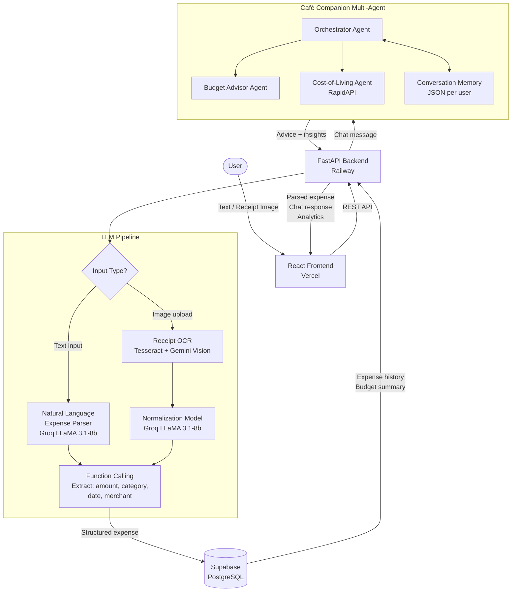

# 💰 BudgetBuddy

> An intelligent personal finance app with AI-powered expense tracking, receipt OCR, and a city-aware café companion for financial advice.

[](https://www.python.org/)
[](https://fastapi.tiangolo.com/)
[](https://reactjs.org/)
[](#)

**Group 3 — DSBA 6010 Spring 2026 | UNC Charlotte**

---

## 🎯 Overview

A full-stack personal budgeting application that combines **Large Language Models (LLMs)** with **computer vision** to make expense tracking effortless. Features natural language processing, receipt OCR, a multi-agent café companion, and location-aware financial insights.

### ✨ Key Features

- 🤖 **AI Café Companion** — Chat with Penny 🐧, Esper 🐉, Mochi 🐱, or Capy 🦫 for personalized budget advice
- 📸 **Receipt OCR** — Upload receipt photos for automatic expense extraction via Gemini Vision + Tesseract
- 💬 **Natural Language Input** — Type "Spent $45 on pizza" instead of filling forms
- 📍 **Location-Aware Insights** — Compare spending across US cities using real-time cost-of-living data
- 📅 **Interactive Calendar** — Visual spending patterns with hover details
- 🎨 **Companion System** — Build friendship levels through consistent tracking
- 📊 **Smart Analytics** — Category breakdowns, trends, and budget alerts

---

## 🚀 Live Deployments

| Service | URL |
|---------|-----|
| 🌐 Frontend (Vercel) | https://budget-buddy-llm-app.vercel.app |
| ⚙️ Backend (Railway) | https://budgetbuddyapp-production.up.railway.app |
| 📖 API Docs | https://budgetbuddyapp-production.up.railway.app/docs |

---

## 🏗️ Architecture

### Frontend (React + TypeScript)
```
src/app/
├── components/
│   ├── BudgetBuddy.tsx        # AI Chat / Café Companion
│   ├── BudgetSettings.tsx     # Budget goal management
│   ├── BudgetSummary.tsx      # Monthly analytics
│   ├── ExpenseList.tsx        # Expense history
│   ├── CompanionSelector.tsx  # Pet selection system
│   └── FriendshipStatus.tsx   # Companion friendship meter
└── dateUtils.ts               # Timezone-safe date handling
```

### Backend (FastAPI + Python)
```
backend/
├── main.py                    # FastAPI entry point & all API routes
├── auth.py                    # JWT authentication
├── database.py                # Supabase PostgreSQL client
├── llm_pipeline.py            # Groq / Gemini LLM wrappers
├── cafe_agents.py             # Multi-agent café companion
├── cafe_tools.py              # Companion memory load/save utilities
├── receipt_parser.py          # OCR + Gemini Vision receipt parsing
├── receipt_to_database.py     # Receipt → expense DB pipeline
├── function_calling.py        # LLM function/tool calling system
├── cost_of_living.py          # RapidAPI cost-of-living integration
└── rag.py                     # RAG system (optional, gracefully disabled)
```

---

## 🧠 LLM Architecture & Flow



### Stage Descriptions

| Stage | Model / Tool | Purpose |
|-------|-------------|---------|
| **Input Routing** | FastAPI | Detects text vs. image input |
| **NLP Parsing** | Groq LLaMA 3.1-8b | Extracts expense fields from natural language |
| **OCR Extraction** | Tesseract + Gemini 2.5 Flash Vision | Reads text from receipt images |
| **Normalization** | Groq LLaMA 3.1-8b | Standardizes amounts, dates, categories |
| **Function Calling** | Groq Tool Use | Structures output into DB-ready JSON |
| **Café Companion** | Multi-agent (Groq) | Conversational budget advisor with memory |
| **Cost-of-Living** | RapidAPI | City-specific financial context |
| **Persistence** | Supabase PostgreSQL | Stores expenses, budgets, user profiles |

---

## 🛠️ Technology Stack

| Layer | Technology | Purpose |
|-------|-----------|---------|
| **Frontend** | React 18 + TypeScript | SPA with Vite bundler |
| **UI Components** | MUI + Radix UI + Tailwind CSS | Accessible, customizable components |
| **Backend** | FastAPI + Python 3.12 | Async REST API |
| **Database** | Supabase (PostgreSQL) | Row-level security, real-time |
| **LLM** | Groq (LLaMA 3.1-8b) | Fast inference for chat & parsing |
| **Vision / OCR** | Gemini 2.5 Flash + Tesseract | Receipt image understanding |
| **Cost Data** | RapidAPI | Real-time city cost-of-living |
| **Auth** | JWT + Supabase | Secure user sessions |
| **Deploy Frontend** | Vercel | Auto-deploy from `main` branch |
| **Deploy Backend** | Railway + Nixpacks | Auto-deploy from `main` branch |

---

## 🚀 Quick Start

### Prerequisites
- **Node.js** 18+ and npm
- **Python** 3.12+
- **Supabase** account (free tier)
- **API Keys** (free tiers available):
  - Groq API (LLM inference)
  - Google Gemini API (vision OCR)
  - RapidAPI (cost-of-living data)

### Installation

```bash
# 1. Clone the repository
git clone https://github.com/uncc-llm/Spring-2026-DSBA-6010-Group-3-Budget-Buddy.git
cd Spring-2026-DSBA-6010-Group-3-Budget-Buddy

# 2. Install frontend dependencies
npm install

# 3. Set up Python environment
python -m venv .venv
.venv\Scripts\activate        # Windows
# source .venv/bin/activate   # macOS/Linux
pip install -r backend/requirements.txt

# 4. Configure environment variables
# Create backend/.env (see Environment Variables section below)

# 5. Set up database
# Run database/schema.sql in your Supabase SQL Editor

# 6. Start the backend
cd backend
uvicorn main:app --reload --port 8000

# 7. In a new terminal, start the frontend
npm run dev
```

**Access the app:**
- 🌐 **Frontend**: http://localhost:5174
- 📖 **API Docs**: http://localhost:8000/docs
- ✅ **Health Check**: http://localhost:8000/

---

## 🔧 Environment Variables

Create `backend/.env`:

```env
# LLM
GEMINI_API_KEY=your_gemini_key
GROQ_API_KEY=your_groq_key
GROQ_MODEL=llama-3.1-8b-instant
LLM_PROVIDER=groq

# Database
SUPABASE_URL=https://xxx.supabase.co
SUPABASE_KEY=your_supabase_anon_key

# External APIs
RAPIDAPI_KEY=your_rapidapi_key

# Auth
JWT_SECRET_KEY=your_jwt_secret

# CORS
FRONTEND_URL=https://budget-buddy-llm-app.vercel.app
CORS_ORIGINS=https://budget-buddy-llm-app.vercel.app,http://localhost:5173,http://localhost:5174

# Server
HOST=0.0.0.0
PORT=8000
DEBUG=True
```

---

## 💡 Usage

### 1. Add an Expense — Natural Language
Type naturally: `"Spent $32 on Uber to airport"` or `"Coffee $5.50 this morning"`
- LLM extracts amount, category, description, and date automatically
- Review and confirm before saving

### 2. Receipt Upload
- Click **Upload Receipt**
- Select a photo (PNG/JPG)
- Gemini Vision + Tesseract auto-extracts amount, merchant, and items
- Review and submit

### 3. Chat with Your Café Companion
Choose your companion — each has a unique personality:
- **Penny the Penguin** 🐧 — Cheerful and encouraging
- **Esper the Dragon** 🐉 — Wise guardian of your treasure
- **Mochi the Cat** 🐱 — Sassy but genuinely helpful
- **Capy the Capybara** 🦫 — Zen and chill financial coach

**Example questions:**
- "Should I cut back on dining out this month?"
- "How does my spending compare to the Charlotte average?"
- "Where can I save on groceries?"

Responses adapt based on companion personality, friendship level (0–100), and your current budget status.

### 4. Analytics & Calendar
- Hover over any calendar day to see expense breakdown
- Category icons + amounts displayed inline
- Monthly budget vs. actual comparison

---

## 📊 Feature Status

| Feature | Status | Description |
|---------|--------|-------------|
| **Natural Language Parser** | ✅ | LLM-powered expense extraction |
| **Receipt OCR** | ✅ | Gemini Vision + Tesseract |
| **AI Café Companion** | ✅ | Multi-agent chat with memory |
| **Cost-of-Living API** | ✅ | City-aware financial context |
| **Budget Tracking** | ✅ | Category limits with alerts |
| **Interactive Calendar** | ✅ | Hover tooltips with expense details |
| **Companion System** | ✅ | Friendship levels + mood |
| **JWT Authentication** | ✅ | Secure login + user profiles |
| **Supabase RLS** | ✅ | Row-level security per user |
| **Responsive Design** | ✅ | Mobile-friendly UI |

---

## 📂 Project Structure

```
BudgetBuddy/
├── src/                        # React frontend
│   ├── app/
│   │   ├── components/         # UI components
│   │   └── App.tsx             # Main app component
│   ├── config.ts               # API base URL config
│   └── main.tsx                # Entry point
├── backend/                    # FastAPI backend
│   ├── main.py                 # App entry + all API routes
│   ├── auth.py                 # JWT authentication
│   ├── database.py             # Supabase client
│   ├── llm_pipeline.py         # LLM wrappers (Groq/Gemini)
│   ├── cafe_agents.py          # Multi-agent companion
│   ├── receipt_parser.py       # OCR pipeline
│   ├── cost_of_living.py       # RapidAPI integration
│   └── requirements.txt
├── database/
│   └── schema.sql              # PostgreSQL schema + RLS
├── supabase/                   # Supabase edge functions
├── docs/                       # Setup documentation
├── vercel.json                 # Vercel deploy config
├── railway.toml                # Railway deploy config
├── nixpacks.toml               # Railway build config
└── README.md
```

---

## 🚢 Deployment

### Backend → Railway
- Auto-deploys from `main` branch via `railway.toml`
- Build: Nixpacks auto-detects Python, installs `backend/requirements.txt`
- Start: `python3 -m uvicorn main:app --host 0.0.0.0 --port $PORT`
- Set all environment variables in Railway dashboard

### Frontend → Vercel
- Auto-deploys from `main` branch via `vercel.json`
- Build: `npm run build` → outputs to `dist/`

---

## 🔒 Security

### Implemented
✅ JWT authentication  
✅ Row-level security (Supabase RLS)  
✅ Input validation (Pydantic)  
✅ Parameterized queries (no SQL injection)  
✅ CORS whitelist for known origins  
✅ `.env` excluded from git  

### Production Recommendations
- Enable HTTPS only (handled by Vercel/Railway)
- Add rate limiting middleware
- Rotate API keys periodically

---

## 📖 Documentation

| Document | Description |
|----------|-------------|
| [docs/SETUP.md](docs/SETUP.md) | Full installation & troubleshooting guide |
| [database/schema.sql](database/schema.sql) | PostgreSQL schema with RLS policies |

---

## 🙏 Acknowledgments

- **Groq** — Fast LLM inference
- **Google Gemini** — Vision + OCR capabilities
- **Supabase** — Backend infrastructure
- **RapidAPI** — Cost-of-living data
- **Radix UI / MUI** — Accessible components
- **Tailwind CSS** — Rapid styling
- **FastAPI** — Modern Python framework
- **Vite** — Lightning-fast dev server

---

## 📊 Project Metrics

- **Backend Endpoints**: 20+
- **Frontend Components**: 10+
- **Database Tables**: 3 (users, expenses, budgets)
- **LLM Providers**: 2 (Groq, Gemini)
- **Companion Personalities**: 4
- **Supported Cities**: 54 (via RapidAPI)

---

**Built with ❤️ for DSBA 6010 — Spring 2026**

**Version:** 1.0.0 | **Status:** ✅ Production Ready | **Last Updated:** April 2026
